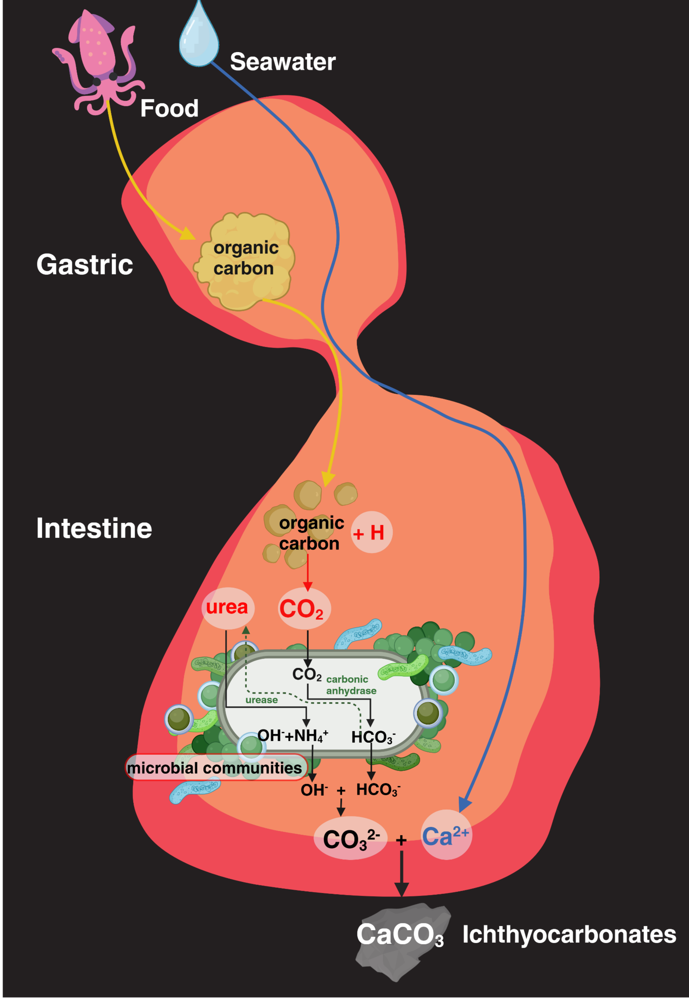

# Microbial contribution to Ichthyocarbonate production in the Gulf Toadfish

Welcome! 🎉  
This repository contains code, data, and outputs for Bonacolta et al. 2025 - Symbiotic bacteria enable calcium carbonate precipitation in the Gulf toadfish (*Opsanus beta*)

---

```text
microbiome/
│
├── picrust/                       # PICRUSt2 outputs for functional prediction
│   ├── EC_predicted.tsv.gz        # Predicted enzyme commission (EC) abundances
│   ├── KO_predicted.tsv.gz        # Predicted KEGG ortholog abundances
├── ASVs.fa                    # Representative ASV sequences
├── ASVs_counts.tsv            # ASV abundance table
├── ASVs_counts_taxonomy.tsv   # ASV counts annotated with taxonomy
├── ASVs_taxonomy.tsv          # Taxonomic classification of ASVs
├── psf.rds                    # Filtered Phyloseq object from R
│
└── transcriptomes/
    ├── code.txt                   # Code use for transcriptomic analysis
    ├── hmm_profiles/              # HMMER analysis
    │   ├── hmms/                  # hmm profiles
    │   ├── fasta/                 # alignments for hmm profiles
    └── SGTs/                      # Single-gene transcriptome datasets
        ├── completed/             # Finished analyses
        ├── redo/                  # Corrected Datasets
        └── trees/                 # Phylogenetic trees
```

## 🔬 Analyses

### Microbiome (Phylsoeq + PICRUSt2)
- ASV data (counts + taxonomy) used for microbiome analysis and to infer metagenomic functions.  
- KO & EC predictions provide functional annotations linked to KEGG pathways and enzyme classifications.  

### Transcriptomes (SGTs)
- Gene-based transcriptome datasets organized for phylogenomic analyses
- Subfolders include SGT and hmm analysis and search for urease genes


## 📧 Contact

If you have questions or suggestions, feel free to reach out to Anthony (abonacolta[at]gmail.com)!



